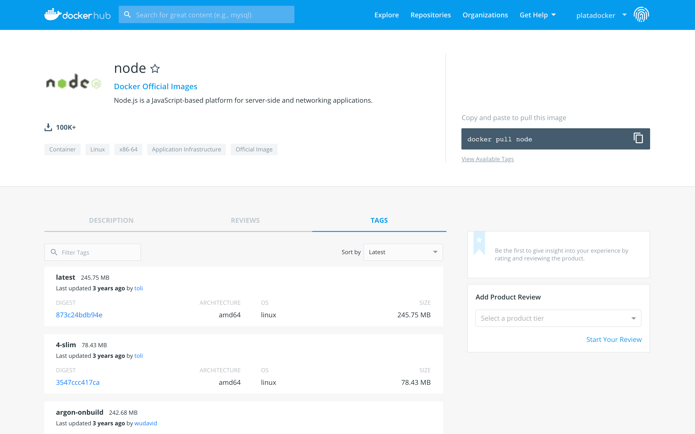
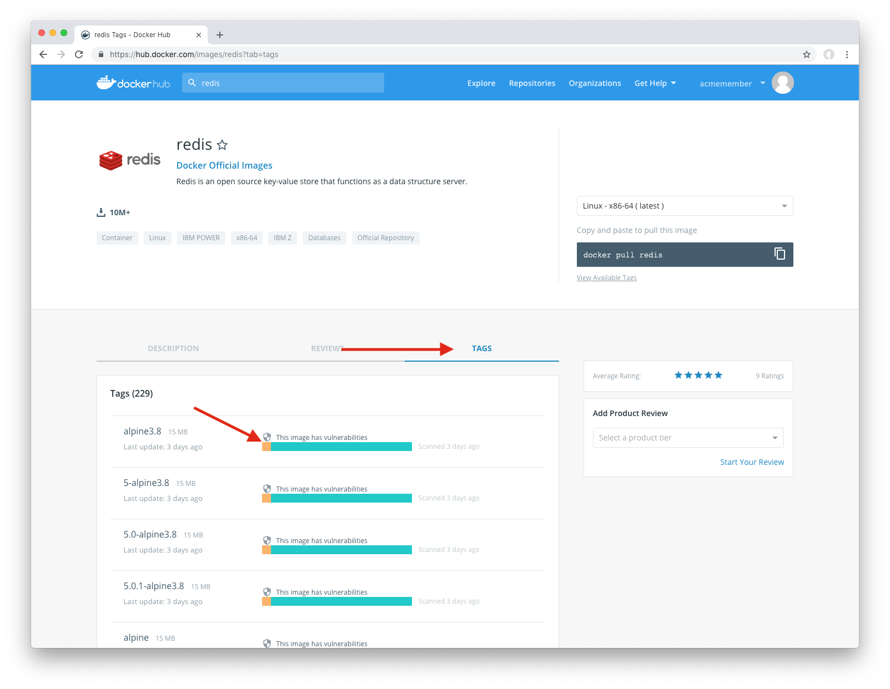


The Docker [Official Images](https://hub.docker.com/search?q=&type=image&image_filter=official) are a
curated set of Docker repositories hosted on Docker Hub. They are
designed to:

Docker の [公式イメージ](https://hub.docker.com/search?q=&type=image&image_filter=official) は Docker Hub 上において提供される、厳選された Docker リポジトリです。
これは以下のことを意識して提供されています。


* Provide essential base OS repositories (for example,
  [ubuntu](https://hub.docker.com/_/ubuntu/),
  [centos](https://hub.docker.com/_/centos/)) that serve as the
  starting point for the majority of users.

* 基本的なベース OS となるリポジトリを提供します。
  （たとえば [ubuntu](https://hub.docker.com/_/ubuntu/), [centos](https://hub.docker.com/_/centos/) などのように）数多くのユーザーにとってスタート地点となるものを提供します。


* Provide drop-in solutions for popular programming language runtimes, data
  stores, and other services, similar to what a Platform as a Service (PAAS)
  would offer.

* 代表的なプログラミング言語環境、データストア、各種サービスといった、PAAS（Platform as a Service）が提供するものにも似た、一時的な実現環境を提供します。


* Exemplify [`Dockerfile` best practices](/engine/userguide/eng-image/dockerfile_best-practices/)
  and provide clear documentation to serve as a reference for other `Dockerfile`
  authors.

* [`Dockerfile` のベストプラクティス](/engine/userguide/eng-image/dockerfile_best-practices/) の例として示し、わかりやすいドキュメントを提供します。
  これによって、`Dockerfile` を作成する際のリファレンスとなるようにします。


* Ensure that security updates are applied in a timely manner. This is
  particularly important as many Official Images are some of the most
  popular on Docker Hub.

* 適切なタイミングでセキュリティアップデートを適用するようにします。
  これは特に重要なことです。
  Docker Hub 上における公式イメージは、人気を得ているものが数多くあるからです。


Docker, Inc. sponsors a dedicated team that is responsible for reviewing and
publishing all content in the Official Images. This team works in
collaboration with upstream software maintainers, security experts, and the
broader Docker community.

Docker 社としては、公式イメージに関わるさまざまな内容に関して、レビューと公開を担当する専門チームを支援しています。
このチームは、ソフトウェア開発元の保守担当、セキュリティ専門家、Docker コミュニティの幅広い方々と共同して作業を進めています。


While it is preferable to have upstream software authors maintaining their
corresponding Official Images, this is not a strict requirement. Creating
and maintaining images for Official Images is a public process. It takes
place openly on GitHub where participation is encouraged. Anyone can provide
feedback, contribute code, suggest process changes, or even propose a new
Official Image.

ソフトウェア開発者が、担当している公式イメージを保守することが好ましいのは言うまでもありません。
しかしこれを厳密に要求することはしていません。
そもそも公式イメージを生成して保守していくことは、公開で行われている作業です。
GitHub 上にて公開で行われているため、そこに参加することが大いに推奨されています。
どなたであっても、フィードバック、コード提供、プロセス変更の提案、さらには新たな公式イメージの提案までもが提供できるわけです。


## When to use Official Images

## 公式イメージをいつ利用するのか
{: #when-to-use-official-images }


New Docker users are encouraged to use the Official Images in their
projects. These images have clear documentation, promote best practices,
and are designed for the most common use cases. Advanced users are encouraged to
review the Official Images as part of their `Dockerfile` learning process.

Docker を初めて利用するユーザーは、公式イメージを用いてプロジェクトを構築することをお勧めしています。
このイメージには分かり易いドキュメントがあって、ベストプラクティスを示しています。
そして一般的な利用を前提にして設計されています。
上級者の方は、`Dockerfile` を勉強する一環として、公式イメージをレビューしていただくことをお願いします。


A common rationale for diverging from Official Images is to optimize for
image size. For instance, many of the programming language stack images contain
a complete build toolchain to support installation of modules that depend on
optimized code. An advanced user could build a custom image with just the
necessary pre-compiled libraries to save space.

公式イメージを取得した後に目指すことは、イメージサイズの最適化です。
たとえばプログラミング言語イメージには、たいていは完全なビルドツールチェーンが含まれていて、最適化コードによるモジュールをインストールできるようにしています。
上級者は独自のイメージをビルドする際には、プリコンパイル済ライブラリを必要な分のみ含めることで、容量を節約することができるかもしれません。


A number of language stacks such as
[python](https://hub.docker.com/_/python/) and
[ruby](https://hub.docker.com/_/ruby/) have `-slim` tag variants
designed to fill the need for optimization. Even when these "slim" variants are
insufficient, it is still recommended to inherit from an Official Image
base OS image to leverage the ongoing maintenance work, rather than duplicating
these efforts.

[python](https://hub.docker.com/_/python/) や [ruby](https://hub.docker.com/_/ruby/) のような数多くのプログラミング言語環境向けには `-slim` というタグをつけています。
これは最適化への要求を満たす目的で作られています。
この「slim」でも不十分に感じる方は、公式イメージ内のベース OS イメージから派生イメージを作り上げて、その後も保守を行っていただくことをお勧めします。
同じやり方を繰り返しても無駄かもしれないからです。


## Official Image Vulnerability Scanning

{: #official-image-vulnerability-scanning }
## 公式イメージのぜい弱性スキャニング


Each of the images in the Official Images is scanned for vulnerabilities. The
results of these security scans provide valuable information about which images
contain security vulnerabilities, and allow you to choose images that align with
your security standards.

公式イメージにある各イメージに対しては、ぜい弱性に関するスキャン処理が行われます。
このセキュリティスキャンの結果には有用な情報が示されます。
どのイメージにぜい弱性があるのかがわかるので、所望のセキュリティ標準を満たすイメージを選ぶことができます。


To view the Docker Security Scanning results:

Docker セキュリティスキャニングの結果を見るには、以下を行います。


1. Make sure you're logged in to Docker Hub. You can view Official Images even
    while logged out, however the scan results are only available once you log
    in.

1. Docker Hub へログインしていることを確認します。
    公式イメージはログアウトしていても参照することができますが、スキャン結果はログインしていなければ見ることはできません。


2. Navigate to the repository of the Official Image whose security scan you want
   to view.

2. 公式イメージのリポジトリにアクセスし、セキュリティスキャン結果を参照します。


3. Click the `Tags` tab to see a list of tags. and their security scan summaries.

3. `Tags` タブをクリックして、タグ一覧とそのセキュリティスキャン結果の概要を確認します。

    
    
    
    


4. Click on a tag to see the image's security scan summary.

4. タグをクリックして、そのイメージに対するセキュリティスキャン結果の概要を確認します。

    
    
    
    


You can click into a tag's detail page to see more information about which
layers in the image and which components within the layer are vulnerable.
Details including a link to the official CVE report for the vulnerability appear
when you click an individual vulnerable component.

タグの詳細ページにクリック移動すれば、イメージ内のどのレイヤに、あるいはレイヤ内のどのコンポーネントにぜい弱性があるかの詳細情報を見ることができます。
ぜい弱性のある個々のコンポーネントをクリックすると、ぜい弱性に関する詳細が表示され、公式の CVE 報告へのリンクが示されます。


## Submitting Feedback for Official Images

## 公式イメージへのフィードバック送信
{: #submitting-feedback-for-official-images }


All Official Images contain a **User Feedback** section in their
documentation which covers the details for that specific repository. In most
cases, the GitHub repository which contains the Dockerfiles for an Official
Repository also has an active issue tracker. General feedback and support
questions should be directed to `#docker-library` on Freenode IRC.

すべての公式イメージのページにはドキュメントが含まれていて、そのリポジトリに対する詳細が説明されています。そしてその中に**ユーザーフィードバック**の節があります。
たいていの場合 GitHub リポジトリには、公式リポジトリに対する Dockerfile が含まれており、さらに有効な issue トラッカーも提供されています。
一般的なフィードバックやサポートに関する質問は、Freenode IRC 上の `#docker-library` に対して行ってください。


## Creating an Official Image

{: #creating-an-official-image }
## 公式イメージの生成


From a high level, an Official Image starts out as a proposal in the form
of a set of GitHub pull requests. Detailed and objective proposal
requirements are documented in the following GitHub repositories:

高度なレベルで話をすると、公式リポジトリは、GitHub のプルリクエストという形での提案から始まります。
詳細な具体的な提案のあり方については、以下の GitHub リポジトリに示されています。

* [docker-library/official-images](https://github.com/docker-library/official-images)

* [docker-library/docs](https://github.com/docker-library/docs)


The Official Images team, with help from community contributors, formally
review each proposal and provide feedback to the author. This initial review
process may require a bit of back-and-forth before the proposal is accepted.

公式イメージの担当チームは、コミュニティに貢献する方々からの協力も得ながら、正式に各提案をレビューし、提案者へのフィードバックを行っています。
ただし提案を受け付けてからレビューを開始するまでには、多少もたつくことがあるかもしれません。


There are also subjective considerations during the review process. These
subjective concerns boil down to the basic question: "is this image generally
useful?" For example, the [python](https://hub.docker.com/_/python/)
Official Image is "generally useful" to the larger Python developer
community, whereas an obscure text adventure game written in Python last week is
not.

レビューを行っていく際には、主観的な議論となることもあります。
そのような主観的な疑問は、「このイメージは汎用的に使えますか？」といった単純な質問に帰着します。
たとえば [python](https://hub.docker.com/_/python/) の公式イメージは、幅広い Python 開発コミュニティにとって「汎用的に使えます」と言えます。
ところが「先週作った Python のアドベンチャーゲーム」といったあいまいな文章では、何も答えられません。


Once a new proposal is accepted, the author is responsible for keeping
their images up-to-date and responding to user feedback. The Official
Repositories team becomes responsible for publishing the images and
documentation on Docker Hub. Updates to the Official Image follow the same
pull request process, though with less review. The Official Images team
ultimately acts as a gatekeeper for all changes, which helps mitigate the risk
of quality and security issues from being introduced.

新たな提案が受け付けられたら、その提案者はイメージを常に最新状態とし、ユーザーフィードバックに返信する責任があります。
公式リポジトリチームには、Docker Hub 上にイメージとドキュメントを公開する義務が発生します。
公式イメージを更新していくことは、レビューを行うことは少ないかもしれませんが、プルリクエストの作業に似ています。
公式イメージチームは、あらゆる活動を最大限管理し、品質リスクやセキュリティ問題の発生を抑えます。
