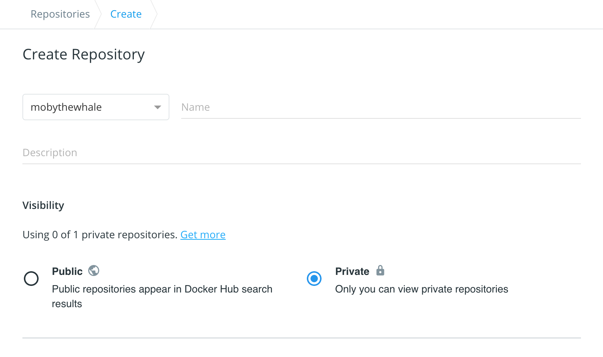
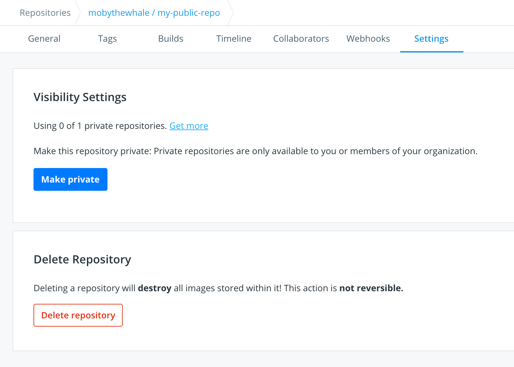
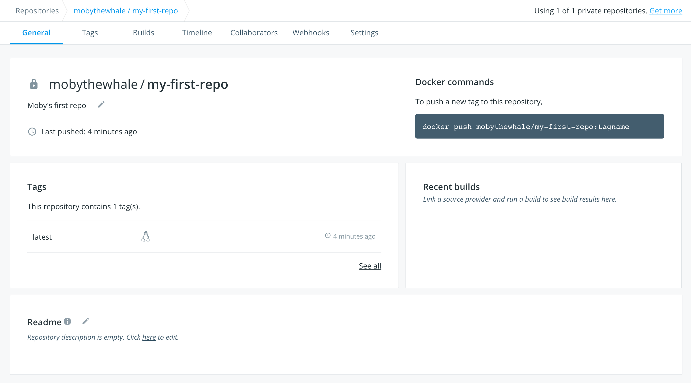
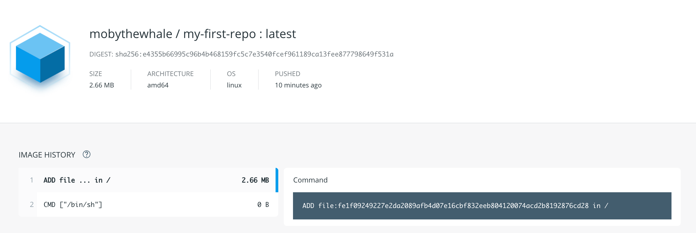


Docker Hub repositories allow you share container images with your team,
customers, or the Docker community at large.

Docker Hub リポジトリは、開発チーム、顧客、Docker コミュニティ全般に対してコンテナーの共有を可能にします。


Docker images are pushed to Docker Hub through the [`docker push`](https://docs.docker.com/engine/reference/commandline/push/)
command. A single Docker Hub repository can hold many Docker images (stored as
**tags**).

Docker イメージは Docker Hub に対して [`docker push`](https://docs.docker.com/engine/reference/commandline/push/) コマンドを使ってプッシュします。
1 つの Docker Hub リポジトリ内には複数の Docker イメージを含めることができます（**タグ**を使って保存します）。


## Creating repositories

{: #creating-repositories }
## リポジトリの生成


To create a repository, sign into Docker Hub, click on **Repositories** then
**Create Repository**:

リポジトリを生成するには Docker Hub にサインインして、**Repositories** をクリックし、さらに **Create Repository** をクリックします。



When creating a new repository:

When creating a new repository:


 * You can choose to put it in your Docker ID
namespace, or in any [organization](orgs.md) where you are an
[_owner_](orgs.md#the-owners-team).

 * You can choose to put it in your Docker ID
namespace, or in any [organization](orgs.md) where you are an
[_owner_](orgs.md#the-owners-team).


* The repository name needs to be unique in that namespace, can be two
to 255 characters, and can only contain lowercase letters, numbers or `-` and
`_`.

* The repository name needs to be unique in that namespace, can be two
to 255 characters, and can only contain lowercase letters, numbers or `-` and
`_`.


* The description can be up to 100 characters and is used in the search
result.

* The description can be up to 100 characters and is used in the search
result.


* You can link a GitHub or Bitbucket account now, or choose to do it
later in the repository settings.

* You can link a GitHub or Bitbucket account now, or choose to do it
later in the repository settings.



After you hit the **Create** button, you can start using `docker push` to push
images to this repository.

**Create** ボタンをクリックした後は、`docker push` を利用してこのリポジトリに対してイメージをプッシュしていくことができます。


## Pushing a Docker container image to Docker Hub

{: #pushing-a-docker-container-image-to-docker-hub }
## Docker コンテナーイメージの Docker Hub へのプッシュ



To push an image to Docker Hub, you must first name your local image using your
Docker Hub username and the repository name that you created through Docker Hub
on the web.



You can add multiple images to a repository by adding a specific `:<tag>` to
them (for example `docs/base:testing`). If it's not specified, the tag defaults
to `latest`.



Name your local images using one of these methods:
* When you build them, using
`docker build -t <hub-user>/<repo-name>[:<tag>]`



* By re-tagging an existing local image `docker tag <existing-image> <hub-user>/<repo-name>[:<tag>]`



* By using `docker commit <existing-container> <hub-user>/<repo-name>[:<tag>]`
to commit changes



Now you can push this repository to the registry designated by its name or tag.

    $ docker push <hub-user>/<repo-name>:<tag>



The image is then uploaded and available for use by your teammates and/or
the community.



## Private repositories



Private repositories let you keep container images private, either to your
own account or within an organization or team.



To create a private repository, select **Private** when creating a repository:







You can also make an existing repository private by going to its **Settings** tab:







You get one private repository for free with your Docker Hub user account (not
usable for organizations you're a member of). If you need more private
repositories for your user account, upgrade your Docker Hub plan from your
[Billing Information](https://hub.docker.com/billing/plan) page.



Once the private repository is created, you can `push` and `pull` images to and
from it using Docker.



> **Note**: You need to be signed in and have access to work with a
> private repository.



> **Note**: Private repositories are not currently available to search through
> the top-level search or `docker search`.



You can designate collaborators and manage their access to a private
repository from that repository's **Settings** page. You can also toggle the
repository's status between public and private, if you have an available
repository slot open. Otherwise, you can upgrade your
[Docker Hub](https://hub.docker.com/account/billing-plans/) plan.



## Collaborators and their role



A collaborator is someone you want to give access to a private repository. Once
designated, they can `push` and `pull` to your repositories. They are not
allowed to perform any administrative tasks such as deleting the repository or
changing its status from private to public.



> **Note**:
> A collaborator cannot add other collaborators. Only the owner of
> the repository has administrative access.



You can also assign more granular collaborator rights ("Read", "Write", or
"Admin") on Docker Hub by using organizations and teams. For more information
see the [organizations documentation](orgs.md).




## Viewing repository tags



Docker Hub's individual repositories view shows you the available tags and the
size of the associated image. Go to the **Repositories** view and click on a
repository to see its tags.











Image sizes are the cumulative space taken up by the image and all its parent
images. This is also the disk space used by the contents of the `.tar` file
created when you `docker save` an image.



To view individual tags, click on the **Tags** tab.







Select a tag's digest to view details.







## Searching for Repositories



You can search the [Docker Hub](https://hub.docker.com) registry through its
search interface or by using the command line interface. Searching can find
images by image name, username, or description:

```
$ docker search centos
NAME                                 DESCRIPTION                                     STARS     OFFICIAL   AUTOMATED
centos                               The official build of CentOS.                   1034      [OK]
ansible/centos7-ansible              Ansible on Centos7                              43                   [OK]
tutum/centos                         Centos image with SSH access. For the root...   13                   [OK]
...
```



There you can see two example results: `centos` and `ansible/centos7-ansible`.
The second result shows that it comes from the public repository of a user,
named `ansible/`, while the first result, `centos`, doesn't explicitly list a
repository which means that it comes from the top-level namespace for
[official images](official_images.md). The `/` character separates
a user's repository from the image name.



Once you've found the image you want, you can download it with `docker pull <imagename>`:

```
$ docker pull centos
latest: Pulling from centos
6941bfcbbfca: Pull complete
41459f052977: Pull complete
fd44297e2ddb: Already exists
centos:latest: The image you are pulling has been verified. Important: image verification is a tech preview feature and should not be relied on to provide security.
Digest: sha256:d601d3b928eb2954653c59e65862aabb31edefa868bd5148a41fa45004c12288
Status: Downloaded newer image for centos:latest
```



You now have an image from which you can run containers.



## Starring Repositories

{: #starring-repositories }
## リポジトリへの星マークづけ


Your repositories can be starred and you can star repositories in return. Stars
are a way to show that you like a repository. They are also an easy way of
bookmarking your favorites.

リポジトリは他の方から星マークをつけてもらうことがあり、逆に他のリポジトリへ星マークをつけることができます。
星マークをつけるのは、好きなリポジトリが何かを公開する方法として使えます。
またお気に入りのリポジトリをブックマークしておくということもできます。
