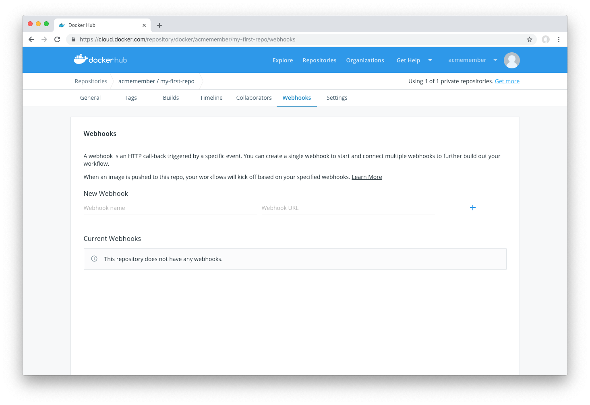


You can use webhooks to cause an action in another service in response to a push event in the repository. Webhooks are POST requests sent to a URL you define in Docker Hub.

リポジトリへのプッシュイベントに呼応して、他のサービスへのアクションを行うウェブフックを利用することができます。
ウェブフックは Docker Hub 上において、設定した URL に対して送信される POST リクエストです。


Configure webhooks through the "Webhooks" tab on your Docker Hub repository:

Docker Hub のリポジトリ画面において「Webhooks」タブを通じてウェブフックを設定してください。






### Create Webhooks

{: #create-webhooks }
### ウェブフックの生成


To create a webhook, visit the webhooks tab for your repository. Then:
1. Provide a name for the webhooks
2. Provide a destination webhook URL. This is where webhook POST requests will be delivered:

ウェブフックを生成するには、リポジトリ画面の Webhooks タブにアクセスし、以下を実行します。
1. ウェブフック名を入力します。
2. 目的とするウェブフック URL を入力します。
   これはウェブフックによる POST リクエストが送信される先を表わします。






### View Webhook delivery history

{: #view-webhook-delivery-history }
### ウェブフック送信履歴の参照


You can view Webhook Delivery History by clicking on the submenu of the webhook and then clicking "View History"

ウェブフックの送信履歴を確認するには、ウェブフックのサブメニューを表示して「View History」をクリックします。







You can then view the delivery history, and whether delivering the POST request was successful or failed:

上により送信履歴を参照することができます。
また POST リクエスト送信の成功、失敗を確認することもできます。







### Example Webhook payload

{: #example-webhook-payload }
### ウェブフック本体部分の例


Docker Hub Webhook payloads have the following payload JSON format:

Docker Hub ウェブフックの本体部分は、以下のような JSON 形式により表現されます。

```json
{
  "callback_url": "https://registry.hub.docker.com/u/svendowideit/testhook/hook/2141b5bi5i5b02bec211i4eeih0242eg11000a/",
  "push_data": {
    "images": [
        "27d47432a69bca5f2700e4dff7de0388ed65f9d3fb1ec645e2bc24c223dc1cc3",
        "51a9c7c1f8bb2fa19bcd09789a34e63f35abb80044bc10196e304f6634cc582c",
        "..."
    ],
    "pushed_at": 1.417566161e+09,
    "pusher": "trustedbuilder",
    "tag": "latest"
  },
  "repository": {
    "comment_count": 0,
    "date_created": 1.417494799e+09,
    "description": "",
    "dockerfile": "#\n# BUILD\u0009\u0009docker build -t svendowideit/apt-cacher .\n# RUN\u0009\u0009docker run -d -p 3142:3142 -name apt-cacher-run apt-cacher\n#\n# and then you can run containers with:\n# \u0009\u0009docker run -t -i -rm -e http_proxy http://192.168.1.2:3142/ debian bash\n#\nFROM\u0009\u0009ubuntu\n\n\nVOLUME\u0009\u0009[/var/cache/apt-cacher-ng]\nRUN\u0009\u0009apt-get update ; apt-get install -yq apt-cacher-ng\n\nEXPOSE \u0009\u00093142\nCMD\u0009\u0009chmod 777 /var/cache/apt-cacher-ng ; /etc/init.d/apt-cacher-ng start ; tail -f /var/log/apt-cacher-ng/*\n",
    "full_description": "Docker Hub based automated build from a GitHub repo",
    "is_official": false,
    "is_private": true,
    "is_trusted": true,
    "name": "testhook",
    "namespace": "svendowideit",
    "owner": "svendowideit",
    "repo_name": "svendowideit/testhook",
    "repo_url": "https://registry.hub.docker.com/u/svendowideit/testhook/",
    "star_count": 0,
    "status": "Active"
  }
}
```


### Validate a webhook callback

{: #validate-a-webhook-callback }
### ウェブフックコールバックの検証


To validate a callback in a webhook chain, you need to

ウェブフックチェーン内の 1 つのコールバックを検証するには、以下の手順が必要となります。


1. Retrieve the `callback_url` value in the request's JSON payload.
1. Send a POST request to this URL containing a valid JSON body.

1. リクエストの JSON 形式部分から `callback_url` の値を取得します。
1. 上が示している URL に対して、正常な JSON 形式の本体を含む POST リクエストを送信します。


> **Note**: A chain request is only considered complete once the last
> callback has been validated.

> **メモ**: チェーンリクエストは、最終のコールバックが正常であることが検証されて、初めて完全なものとして受け付けられます。



#### Callback JSON data

{: #callback-json-data }
#### コールバックの JSON データ


The following parameters are recognized in callback data:

コールバックデータ内では、以下のパラメーターが識別されます。


* `state` (required): Accepted values are `success`, `failure`, and `error`.
  If the state isn't `success`, the Webhook chain is interrupted.
* `description`: A string containing miscellaneous information that is
  available on Docker Hub. Maximum 255 characters.
* `context`: A string containing the context of the operation. Can be retrieved
  from the Docker Hub. Maximum 100 characters.
* `target_url`: The URL where the results of the operation can be found. Can be
  retrieved on the Docker Hub.

* `state` (必須): 受け入れ可能な値は `success`, `failure`, `error` のいずれか。
  `state` の値が `success` ではない場合、ウェブフックチェーンは中断されます。
* `description`: Docker Hub 上において利用するさまざまな情報を含んだ文字列。
  255 文字まで。
* `context`: 処理対象のコンテキストに関する文字列。
  Docker Hub から取り出すことができます。
  100 文字まで。
* `target_url`: 処理結果が得られる URL。
  Docker Hub から取り出すことができます。


*Example callback payload:*

**コールバック本体部分の例**

    {
      "state": "success",
      "description": "387 tests PASSED",
      "context": "Continuous integration by Acme CI",
      "target_url": "http://ci.acme.com/results/afd339c1c3d27"
    }
